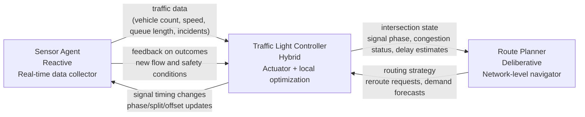

## Interaction diagram

## Classified agent table

| Agent                    | Agent Type       | Short justification                                                                                                                        |
| ------------------------ | ---------------- | ------------------------------------------------------------------------------------------------------------------------------------------ |
| Sensor Agent             | **Reactive**     | It continuously senses vehicles, speeds, and incidents and immediately reports current conditions without long-term planning.              |
| Traffic Light Controller | **Hybrid**       | It must react instantly to changing traffic and pedestrian safety events, while also using goal-based timing logic and optimization rules. |
| Route Planner            | **Deliberative** | It evaluates broader network conditions, compares route options, and selects plans that optimize travel time, safety, and emissions.       |

## How I decided on each classification

I used three key attributes: **response speed**, **amount of internal reasoning**, and **planning horizon**.

* **Sensor Agent → Reactive**: its main job is perception, not planning; it responds to the current state of the road and pushes fresh data as conditions change.
* **Traffic Light Controller → Hybrid**: it needs **reactive behavior** for emergencies, queue spikes, and pedestrian calls, but also **deliberative logic** to balance safety, throughput, and coordination across signal phases.
* **Route Planner → Deliberative**: it works best when it can reason over maps, congestion trends, travel objectives, and predicted traffic, which are all planning-heavy tasks.

The classification matters because the intersection system has both **millisecond-level control needs** and **network-level optimization needs**, so one agent style alone would be too limited.

## 100–150 word analysis: effects on speed, scalability, and decision quality

Using different agent types changes how well the traffic system performs. **Reactive agents** are fastest because they respond directly to live inputs, which makes them ideal for sensing and urgent control tasks such as queue overflow or pedestrian protection. Their weakness is that they can be brittle: they solve the immediate problem but may ignore wider network effects. **Deliberative agents** improve decision quality because they compare alternatives, forecast congestion, and optimize routes across many intersections, but they are slower and more computationally expensive. **Hybrid agents** provide the best balance for signal control by combining fast local reactions with higher-level optimization. This improves resilience and scalability: the system can keep operating safely under sudden disturbances while still coordinating broader traffic goals. In practice, mixing types usually outperforms using only one type everywhere.

## What surprised me and what I would do differently in a real deployment

What surprised me is that the **Traffic Light Controller** does not fit neatly into only one category; real intersections need both instant response and planned coordination, so **Hybrid** is much more realistic than purely Reactive. I was also struck by how strong the feedback loop is: route decisions change traffic patterns, which then change what sensors detect and how signals should behave.

In a real deployment, I would add one more layer: a **human-supervised safety and policy module** for overrides, audits, and fail-safe operation. I would also separate short-term control from citywide optimization so that a network failure in planning would not stop safe local intersection behavior.
