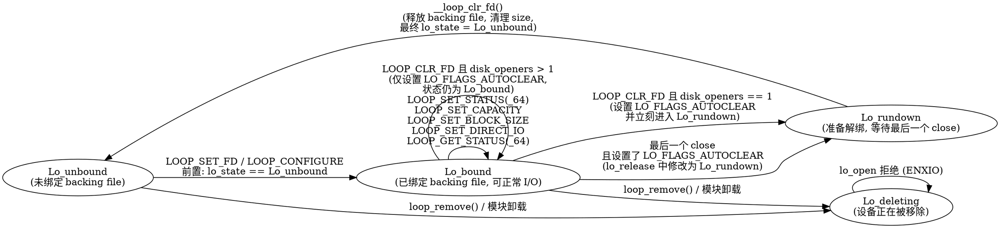

下面我给你一份**非常系统化的 List**：来自 Linux 内核里**最典型、最适合抽象为“ioctl 状态机”**的驱动（多数已在 x86 QEMU 中可运行，完全适合 fuzz）。

列表来源＝Linux 主线（drivers/*）中：
✔ 有 ioctl
✔ 存在“状态前置条件 + 状态更新”
✔ 能抽象成状态机（open → setup → run → stop → close）
✔ fuzz 时极易触发状态相关 bug 的驱动

我把它们按子系统分类，让你能有针对性地扩展 fuzz driver。

---

# ⭐ 第一类：最适合做状态机建模的驱动（强状态机，结构清晰）

以下驱动**状态机最清晰**，适合作为你 NPU 状态机建模的样例集。

---

## 1. V4L2（Linux 视频子系统）驱动

状态机模式：**open → set_format → reqbufs → mmap/qbuf → streamon → streamoff → close**
典型状态变量：`state` / `flags` / buffer_state / streaming flag

### ✔ UVC 摄像头

```
drivers/media/usb/uvc/*
```

特征：

* `queue->flags`（BIT 状态机）
* `uvc_buffer_state` 多态状态机
* ioctl: REQBUFS, QBUF, DQBUF, STREAMON/OFF

---

### ✔ USB 采集卡：cx231xx / em28xx / au0828

```
drivers/media/usb/cx231xx/*
drivers/media/usb/em28xx/*
drivers/media/usb/au0828/*
```

特征：

* `state` bitmap
* 多路径状态机：视频/音频/调谐器

---

### ✔ PCI 视频采集卡（x86 可用）

```
drivers/media/pci/solo6x10/*
drivers/media/pci/bt8xx/*
drivers/media/pci/ivtv/*
```

特征：

* MHz 级 DVR 卡，复杂 ioctl + 显式状态检查
* bt8xx/ivtv 状态机比 UVC 更丰富

---

### ✔ V4L2 子设备（sensor / bridge）

```
drivers/media/i2c/*
```

特征：

* 很多 sensor 驱动有 `state` + bit
* ioctl：s_power, s_stream, s_config

适合你从中提取“设备配置/启动/停止”类状态机。

---

# ⭐ 第二类：DRM / GPU 驱动（非常适合 QEMU + fuzz）

这些是 fuzzers 最喜欢的，因为 ioctl 复杂、对象生命周期多、状态依赖重。

---

## 2.1 Virtio GPU（QEMU 完全支持）

```
drivers/gpu/drm/virtio/*
```

状态机特征：

* buffer object 申请/释放
* context create/destroy
* resource attach/detach

✔ QEMU 中完全可运行！
→ 是你在 QEMU 环境里 fuzz ioctl 状态机的最佳选择之一。

---

## 2.2 Bochs DRM（QEMU "stdvga" / "bochs-display"）

```
drivers/gpu/drm/bochs/*
```

状态机非常简单但完整：

* create fb → map → flush → invalidate → destroy

---

## 2.3 QXL（QEMU spice 显卡）

```
drivers/gpu/drm/qxl/*
```

特征：

* explicitly uses `state` (primary/secondary surface state)
* many ioctls: create, map, release, cursor control
* 强对象生命周期状态机

---

## 2.4 VGA/VBE (uvesafb/framebuffer ioctls)

```
drivers/video/fbdev/uvesafb*
```

状态机涉及：

* mode switch
* memory mapping
* fb_pan_display()
  fbdev 的 ioctl 都有严格状态（mmap 前不能 pan，set_par 后才能写 buffer）。

---

# ⭐ 第三类：块设备 / 存储（大量 ioctl + 清晰状态约束）

这些在纯 QEMU 环境也能完整 fuzz：

---

## 3.1 Loop 设备

```
drivers/block/loop.c
```

状态机极其明确：

* LOOP_SET_FD
* LOOP_SET_STATUS
* LOOP_CHANGE_FD
* LOOP_CLR_FD
* must be "bound" before I/O
  非常适合抽象为有限状态机。

---

## 3.2 设备映射（DM）

```
drivers/md/dm-ioctl.c
```

状态机：

* create table → load → suspend → resume → remove
  强制顺序依赖。

---

## 3.3 MD/RAID

```
drivers/md/md.c
```

ioctl:

* start array
* stop array
* add disk
* remove disk
* reshape

每条 ioctl 都依赖阵列状态，很强的可抽象性。

---

# ⭐ 第四类：输入设备（状态机简单但有前置依赖）

---

## 4.1 evdev

```
drivers/input/evdev.c
```

状态机：

* open
* grab/ungrab
* set key repeat → requires open
* write event

---

## 4.2 joystick / input misc

```
drivers/input/joystick/*
drivers/input/misc/*
```

多数都有 ioctl，比如 `JSIOCGAXMAP`、`JSIOCGBTNMAP`，状态依赖不复杂但可抽象。

---

# ⭐ 第五类：音频（ALSA）驱动（非常典型的状态机）

---

## 5.1 ALSA PCM

```
sound/core/pcm_native.c
```

状态机是内核中最经典的例子之一：

* OPEN
* SET HW PARAMS
* PREPARE
* START
* PAUSE
* RESUME
* DRAIN
* DROP
* CLOSE

用 `runtime->status->state` 管理，状态是枚举而不是 bitset → 但状态机更清晰！

绝对适合你的状态自动提取算法。

---

# ⭐ 第六类：网络驱动（ioctl 较少，但部分设备有独特状态机）

---

## 6.1 TUN/TAP

```
drivers/net/tun.c
```

ioctl:

* TUNSETIFF
* TUNSETOWNER
* TUNSETPERSIST
* TUNSETQUEUE
* 状态依赖：必须创建 → 配置 → attach queue → I/O

---

## 6.2 CAN 驱动

```
drivers/net/can/*
```

状态机：

* set_bittiming
* set_mode (start/stop)
* bus-off / recovery
  bit timing + 状态切换非常明确。

---

# ⭐ 第七类：USB 子系统（非视频类）

---

## 7.1 USB Gadget

```
drivers/usb/gadget/*
```

几乎每个 gadget function（mass storage, ethernet, serial）都有状态机，例如：

* bind
* setup
* enable
* disable
* suspend

---

## 7.2 USB Serial

```
drivers/usb/serial/*
```

ioctl 如：

* SET_LINE
* SET_CONTROL
* BREAK
  这些依赖“是否 open、是否 connected”状态。

---

# ⭐ 第八类：字符设备（misc/tty 类）

一些 misc drivers 的状态机出奇地复杂：

---

## 8.1 TTY 核心

```
drivers/tty/tty_io.c
```

ioctl 如：TCSETS、TCGETS、TIOCSBRK/TIOCCBRK，前置条件严格（tty 已打开等）。

---

## 8.2 DRM render nodes

```
drivers/gpu/drm/drm_ioctl.c
```

通用对象生命周期：

* gem_create
* gem_mmap
* prime export/import
  状态依赖清晰。

---

# ⭐ 如果你只需要“最适合作为 NPU 类状态机样例”的驱动，我推荐：

| 类别       | 驱动                                | 说明              |
| -------- | --------------------------------- | --------------- |
| V4L2     | `uvcvideo`, `cx231xx`, `solo6x10` | 状态机与 NPU 最接近    |
| DRM      | `virtio-gpu`, `qxl`, `bochs`      | QEMU 能跑，适合 fuzz |
| ALSA PCM | `sound/core/pcm_native.c`         | Linux 最标准状态机    |
| Block    | `loop`, `dm`, `md`                | ioctl 顺序依赖极强    |
| Net      | `tun`                             | 不复杂但有严格配置顺序     |

---

# ⭐ 如果你愿意，我可以帮你：

### ✔ 为每个驱动自动生成：

* ioctl 列表
* 每条 ioctl 的前置状态
* 每条 ioctl 的后置状态
* 自动抽象成 DOT 状态机图
* 生成 AFL 的 fuzz driver stub（包含合法状态序列）

### ✔ 或者：

* 我帮你挑一批“最易 fuzz 出 bug 的目标”，生成优先级列表。

告诉我你关心的是：
**QEMU 可运行优先？状态机复杂度优先？类似 NPU 的 ioctl 模式优先？还是你准备 fuzz 综合子系统？**


loop 驱动本身在代码里已经有一个非常清晰的“状态机”，核心就是 `lo->lo_state` 这个字段：([codebrowser.dev][1])

```c
/* Possible states of device */
enum {
    Lo_unbound,
    Lo_bound,
    Lo_rundown,
    Lo_deleting,
};
```

下面我先给你一张 **DOT 状态机图**，然后再逐条解释每个状态和关键 ioctl/操作的前置条件和效果。

---

## 1. loop 的 DOT 状态机

你可以直接把下面这段保存为 `loop.dot`，用 `dot -Tpng loop.dot -o loop.png` 画图：



---

## 2. 每个状态的含义

### Lo_unbound（未绑定）

* 没有 `lo_backing_file`，设备只是一个空壳。([codebrowser.dev][1])
* 常见初始状态（刚创建的 /dev/loopX）。
* 只能通过 **绑定类 ioctl** 进入下一状态：

  * `LOOP_SET_FD`（老接口，内部现在会走 `loop_configure()` 路径）([codebrowser.dev][1])
  * `LOOP_CONFIGURE`（新接口，直接调用 `loop_configure()`）([codebrowser.dev][1])
* 在 `loop_configure()` 里，如果 `lo_state != Lo_unbound` 就直接 `-EBUSY`：([codebrowser.dev][1])

  ```c
  error = -EBUSY;
  if (lo->lo_state != Lo_unbound)
      goto out_unlock;
  ```

---

### Lo_bound（已绑定，可 I/O）

* `loop_configure()` 成功后会设置：([codebrowser.dev][1])

  ```c
  lo->lo_state = Lo_bound;
  ```
* 此时：

  * `lo_backing_file` 已设置；
  * queue limits、block size 等已经按 backing file 计算；
  * 可以正常接收 block I/O 请求。
* I/O 路径中有显式检查：([codebrowser.dev][1])

  ```c
  if (lo->lo_state != Lo_bound)
      return BLK_STS_IOERR;
  ```

  也就是说只有在 Lo_bound 才会成功处理请求；其它状态返回 I/O 错误。
* **仅在 Lo_bound 状态下** 许多 ioctl 才有效，比如：([codebrowser.dev][1])

  * `LOOP_SET_STATUS(_64)`：修改 offset、sizelimit、flags 等；
  * `LOOP_GET_STATUS(_64)`：查询当前配置；
  * `LOOP_SET_CAPACITY` / `LOOP_SET_BLOCK_SIZE` / `LOOP_SET_DIRECT_IO` 等。
* 典型的状态保持操作（状态不变，只改配置）：

  ```c
  if (lo->lo_state != Lo_bound)
      return -ENXIO;
  // 各种更新 lo_flags / size / DIO 等
  ```

---

### Lo_rundown（清理中/等待解绑）

这个状态是 loop 状态机里比较关键的一部分，用来做 **“延迟解绑”**，避免竞态。([codebrowser.dev][1])

触发路径有两种：

1. **显式调用 `LOOP_CLR_FD`，且只有一个 opener**
   `loop_clr_fd()`：([codebrowser.dev][1])

   ```c
   err = loop_global_lock_killable(lo, true);
   if (err)
       return err;
   if (lo->lo_state != Lo_bound) {
       loop_global_unlock(lo, true);
       return -ENXIO;
   }

   lo->lo_flags |= LO_FLAGS_AUTOCLEAR;
   if (disk_openers(lo->lo_disk) == 1)
       lo->lo_state = Lo_rundown;
   loop_global_unlock(lo, true);
   ```

   * 前置: `lo_state == Lo_bound`
   * 结果:

     * 总是设置 `LO_FLAGS_AUTOCLEAR`；
     * 若当前只有一个 open，则立即转入 `Lo_rundown`。

2. **多 opener 情况下的最后一次 close**
   在 `lo_release()` 的最后一次 close 路径中：([codebrowser.dev][1])

   ```c
   if (disk_openers(disk) > 0)
       return;

   mutex_lock(&lo->lo_mutex);
   if (lo->lo_state == Lo_bound &&
       (lo->lo_flags & LO_FLAGS_AUTOCLEAR))
       lo->lo_state = Lo_rundown;

   need_clear = (lo->lo_state == Lo_rundown);
   mutex_unlock(&lo->lo_mutex);

   if (need_clear)
       __loop_clr_fd(lo);
   ```

   * 也就是说，如果之前 `LOOP_CLR_FD` 只是打了 `AUTOCLEAR` 标记（但当时有多个 opener），那么在最后一个 fd close 时，会从 Lo_bound 变为 Lo_rundown，并调用 `__loop_clr_fd()` 做真正的解绑。

**Lo_rundown 状态下的行为：**

* `lo_open()` 会拒绝新的 open：([codebrowser.dev][1])

  ```c
  if (lo->lo_state == Lo_deleting || lo->lo_state == Lo_rundown)
      err = -ENXIO;
  ```
* I/O 路径 `loop_queue_rq()` 中也会因为 `lo_state != Lo_bound` 而直接失败 (`BLK_STS_IOERR`)。([codebrowser.dev][1])
* 最终由 `__loop_clr_fd()` 把所有资源释放并把状态切回 `Lo_unbound`。

---

### Lo_deleting（设备删除中）

* 用于设备被 `/dev/loop-control` 的 `LOOP_CTL_REMOVE` 等操作删除，或者模块卸载时。
* 在 `lo_open()` 中，与 Lo_rundown 一样，直接拒绝 open：([codebrowser.dev][1])

  ```c
  if (lo->lo_state == Lo_deleting || lo->lo_state == Lo_rundown)
      err = -ENXIO;
  ```
* 对 fuzz driver 来说可以把它看作 **终态**，一般不会通过普通的 `/dev/loopX` ioctl 进入（更多是控制接口 / 模块卸载的行为）。

---

## 3. 结合 fuzzing 的简化抽象建议

如果你的目标是给 AFL 做 **ioctl 状态机约束**，可以适当简化：

* 只保留 3 个“逻辑状态”：

  1. `U` = Unbound  (`Lo_unbound`)
  2. `B` = Bound    (`Lo_bound`)
  3. `R` = Rundown  (`Lo_rundown` + `Lo_deleting` 都视为“不可用”)

* 事件（边）：

  * `bind`：`U --(LOOP_SET_FD / LOOP_CONFIGURE)--> B`
  * `configure`：`B --(LOOP_SET_STATUS/SET_CAPACITY/SET_BLOCK_SIZE/SET_DIRECT_IO/GET_STATUS)--> B`
  * `clear_fd`：

    * 如果“模拟环境”里 `openers == 1`：`B --(LOOP_CLR_FD)--> R`
    * 否则：`B --(LOOP_CLR_FD)--> B`（只记下 AUTOCLEAR 标志即可）
  * `last_close`：

    * 如果之前被 `clear_fd` 标过：`B -> R -> U`
  * `device_remove`：`U/B -> R`（可以直接当成 `R` 终态）

* 对 AFL 的约束：

  * 想 fuzz 这些 ioctl：`LOOP_SET_STATUS(_64)`, `LOOP_SET_DIRECT_IO`, `LOOP_SET_BLOCK_SIZE`, `LOOP_SET_CAPACITY`, `LOOP_GET_STATUS(_64)`
    → 必须处于 `B`。
  * 想 fuzz I/O 请求（读写 loop 设备本身）
    → 也必须处于 `B`。
  * 处于 `R` 时，新 open/更多 ioctl 基本都会失败，用于覆盖错误路径也可以，但对“正确驱动”探索帮助不大。

如果你愿意，我可以 **按你现在的 fuzz driver 结构**，再帮你写一个“loop 专用”的状态机描述结构（比如 JSON 或 C 里的表驱动形式），方便自动生成 DOT 或约束 AFL 的 mutator。

[1]: https://codebrowser.dev/linux/linux/drivers/block/loop.c.html "loop.c source code [linux/drivers/block/loop.c] - Codebrowser "
