我给你一个**分层的 i915 状态机**，专门从 *ioctl 视角* 来抽象，方便你后面做自动提取 & fuzz driver 约束。

> 说明：
>
> * 这是“**抽象出来的逻辑状态机**”，不是内核里真的有 `enum state`。
> * 我只挑了 i915 中最核心的一些流程：
>
>   * 设备 / 文件 / master / KMS
>   * GEM buffer
>   * context + EXECBUFFER
> * 每条边尽量标出对应的 **ioctl / 关键函数**，这样你可以对照代码自动抽取。

---

## 一、i915 设备 / drm_file / master / KMS 状态机

这部分基本是“i915 + DRM core”的组合，粒度是 **“一个 /dev/dri/cardX + 某个打开的 drm_file”**。

```dot
digraph i915_device_file_state {
    rankdir=LR;
    node [shape=ellipse];

    DEV_UNBOUND        [label="DEV_UNBOUND\n模块未加载/PCI未绑定"];
    DEV_PROBED         [label="DEV_PROBED\nintel_pci_probe()\ni915 硬件初始化"];
    DEV_REGISTERED     [label="DEV_REGISTERED\n/drm_dev_register\n/dev/dri/cardX 存在"];
    FILE_CLOSED        [label="FILE_CLOSED\n当前进程未 open"];
    FILE_OPEN_NO_MASTER[label="FILE_OPEN_NO_MASTER\n有 drm_file\n但非 master"];
    FILE_MASTER        [label="FILE_MASTER\nfile_priv->is_master = 1"];
    FILE_KMS_CONFIGURED[label="FILE_KMS_CONFIGURED\n有 CRTC+FB+connector\ni915 modeset 完成"];
    FILE_RENDERING     [label="FILE_RENDERING\n有 GEM/EXECBUFFER job 在飞"];
    DEV_SUSPENDED      [label="DEV_SUSPENDED\nsuspend/runtime PM"];
    DEV_REMOVED        [label="DEV_REMOVED\npci_remove/module_exit"];

    // 设备生命周期（i915 驱动）
    DEV_UNBOUND    -> DEV_PROBED     [label="i915_pci_probe()\nintel_driver_load()"];
    DEV_PROBED     -> DEV_REGISTERED [label="drm_dev_register()\n创建设备节点"];
    DEV_PROBED     -> DEV_REMOVED    [label="probe 失败/回滚"];
    DEV_REGISTERED -> DEV_REMOVED    [label="i915_pci_remove()\nmodule_exit()"];

    // 文件 open/close -> drm_file
    DEV_REGISTERED -> FILE_CLOSED    [label="进程尚未 open\n(逻辑态)"];
    FILE_CLOSED    -> FILE_OPEN_NO_MASTER [label="open(/dev/dri/card0)\n-> drm_open(), i915_drm_open()"];
    FILE_OPEN_NO_MASTER -> FILE_CLOSED    [label="close(fd)\n-> drm_release(), i915_drm_release()"];

    // master 相关 ioctl
    FILE_OPEN_NO_MASTER -> FILE_MASTER [label="ioctl(DRM_IOCTL_SET_MASTER)\n或第一个打开获得 master"];
    FILE_MASTER -> FILE_OPEN_NO_MASTER [label="ioctl(DRM_IOCTL_DROP_MASTER)\n或 master 进程退出"];

    // modeset/KMS 配置（i915 基本用 atomic KMS）
    FILE_MASTER -> FILE_KMS_CONFIGURED [label="KMS ioctls:\nDRM_IOCTL_MODE_ADDFB2\nDRM_IOCTL_MODE_ATOMIC\n成功启用 CRTC+plane+connector"];
    FILE_KMS_CONFIGURED -> FILE_MASTER [label="MODE_ATOMIC\n关闭所有 CRTC/输出\n(restore console / 全部 inactive)"];
    FILE_KMS_CONFIGURED -> FILE_OPEN_NO_MASTER [label="其他进程抢占 master\n或本进程 DROP_MASTER"];

    // 渲染/execbuffer：只要有 job 在飞就进入 FILE_RENDERING
    FILE_MASTER -> FILE_RENDERING [label="i915 GEM ioctls:\nDRM_IOCTL_I915_GEM_EXECBUFFER2\n(创建 context/job 并提交)"];
    FILE_KMS_CONFIGURED -> FILE_RENDERING [label="同上\n(display + render 同时使用)"];
    FILE_RENDERING -> FILE_MASTER [label="所有 job 完成 / fence signal\n无 in-flight 请求"];
    FILE_RENDERING -> FILE_KMS_CONFIGURED [label="同上，但保留 KMS display 配置"];
    FILE_RENDERING -> FILE_OPEN_NO_MASTER [label="master 权限丢失\n或 GPU hang\n(可能 ban context)"];

    // suspend / resume
    DEV_REGISTERED     -> DEV_SUSPENDED [label="i915_drm_suspend()\nruntime/system suspend"];
    FILE_OPEN_NO_MASTER-> DEV_SUSPENDED [label="同上，需 quiesce i/o"];
    FILE_MASTER        -> DEV_SUSPENDED [label="同上，保存 KMS state"];
    FILE_KMS_CONFIGURED-> DEV_SUSPENDED [label="同上，关闭 CRTC/plane"];
    FILE_RENDERING     -> DEV_SUSPENDED [label="同上，flush/abort job"];

    DEV_SUSPENDED -> DEV_REGISTERED      [label="i915_drm_resume()\n无打开文件"];
    DEV_SUSPENDED -> FILE_OPEN_NO_MASTER [label="resume 后 drm_file 恢复\n但非 master"];
    DEV_SUSPENDED -> FILE_MASTER         [label="resume 后 master 恢复"];
    DEV_SUSPENDED -> FILE_KMS_CONFIGURED [label="resume 后重新 modeset"];
    DEV_SUSPENDED -> FILE_RENDERING      [label="resume 后重新提交 job"];
    DEV_SUSPENDED -> DEV_REMOVED         [label="挂起期间被移除(理论上可能)"];
}
```

> 用法：
>
> * 你在解析 i915 源码时，可以把
>
>   * `i915_pci_probe/i915_drm_suspend/i915_drm_resume`
>   * `i915_drm_open/i915_drm_release`
>   * `DRM_IOCTL_SET_MASTER / DROP_MASTER / MODE_ATOMIC / GEM_EXECBUFFER2`
>     这些函数映射到上面这张图的边。

---

## 二、i915 GEM buffer 状态机（对象级）

粒度：**单个 GEM BO（`struct i915_vma` / `drm_i915_gem_object`）**。
只保留和 ioctl 强相关的几个典型状态：创建、域切换、执行、释放。

```dot
digraph i915_gem_bo_state {
    rankdir=LR;
    node [shape=ellipse];

    BO_NONE        [label="BO_NONE\n(尚未存在)"];
    BO_CREATED     [label="BO_CREATED\nGEM_CREATE 后\n未绑定/未映射"];
    BO_CPU_DOMAIN  [label="BO_CPU_DOMAIN\n当前 domain=CPU\n可CPU访问"];
    BO_GTT_DOMAIN  [label="BO_GTT_DOMAIN\n已绑定 GTT, domain=GTT\n可通过 GTT MMAP 访问"];
    BO_EXEC_BOUND  [label="BO_EXEC_BOUND\n已绑定到某个 context 的\nexecbuffer 虚拟地址空间"];
    BO_IN_FLIGHT   [label="BO_IN_FLIGHT\n正在 GPU 上执行\n有 active request"];
    BO_IDLE        [label="BO_IDLE\n执行完成\n可再次复用或释放"];
    BO_CLOSED      [label="BO_CLOSED\n用户 handle 关闭\nobject 引用归零被释放"];

    // 创建
    BO_NONE    -> BO_CREATED    [label="DRM_IOCTL_I915_GEM_CREATE\n或\nDRM_IOCTL_I915_GEM_CREATE_EXT"];

    // domain 切换
    BO_CREATED -> BO_CPU_DOMAIN [label="GEM_SET_DOMAIN\nread_domains=CPU\nwrite_domain=CPU\n或 CPU mmap fault"];
    BO_CREATED -> BO_GTT_DOMAIN [label="GEM_SET_DOMAIN\nread/write_domain=GTT\n或 GEM_MMAP_GTT 建立映射"];
    BO_CPU_DOMAIN -> BO_GTT_DOMAIN [label="SET_DOMAIN -> GTT"];
    BO_GTT_DOMAIN -> BO_CPU_DOMAIN [label="SET_DOMAIN -> CPU\n或 CPU PREAD/PWRITE"];

    // execbuffer 绑定 & job 提交
    BO_CPU_DOMAIN -> BO_EXEC_BOUND [label="GEM_EXECBUFFER2\n构造 exec obj list\n绑定 vma 到 GTT/ppGTT"];
    BO_GTT_DOMAIN -> BO_EXEC_BOUND [label="同上\n(已在 GTT domain)"];

    BO_EXEC_BOUND -> BO_IN_FLIGHT [label="submit to GPU\nintel_ring_submit_request()"];
    BO_IN_FLIGHT -> BO_IDLE       [label="GPU 完成\n中断 -> i915_gem_request_retire()"];

    // 使用完仍可重新被 EXECBOUND
    BO_IDLE -> BO_EXEC_BOUND [label="再次 execbuffer 引用\n重复提交"];

    // handle/对象释放
    BO_CREATED    -> BO_CLOSED [label="DRM_IOCTL_GEM_CLOSE\n或 drm_file 关闭\n且无其他引用"];
    BO_CPU_DOMAIN -> BO_CLOSED [label="同上"];
    BO_GTT_DOMAIN -> BO_CLOSED [label="同上\n同时 unbind/evict"];
    BO_EXEC_BOUND -> BO_CLOSED [label="关闭 fd / 驱动清理\n会先撤销绑定/等待完成"];
    BO_IDLE       -> BO_CLOSED [label="最后一个引用释放\n释放对象内存"];
}
```

> 对应代码特征：
>
> * ioctl handler 中大量 `drm_gem_object_lookup()` / `i915_gem_object_pin_unlocked()` / `i915_gem_object_unpin()`。
> * `i915_gem_object_set_to_cpu_domain()` / `_set_to_gtt_domain()` 对应 domain 状态转移。
> * request 完成路径中会从 active list 移到 inactive，反映 `IN_FLIGHT -> IDLE`。

---

## 三、i915 context + EXECBUFFER 状态机

粒度：**单个 i915 context（`struct i915_gem_context`）**，配合 `EXECBUFFER2` / hang / ban 逻辑。

```dot
digraph i915_context_state {
    rankdir=LR;
    node [shape=ellipse];

    CTX_NONE      [label="CTX_NONE\n尚未分配 context"];
    CTX_CREATED   [label="CTX_CREATED\nGEM_CONTEXT_CREATE 后\n还未提交 job"];
    CTX_ACTIVE    [label="CTX_ACTIVE\n有 in-flight requests\n(至少一个 execbuffer 正在跑)"];
    CTX_IDLE      [label="CTX_IDLE\n无 in-flight request\n可再次提交"];
    CTX_BANNED    [label="CTX_BANNED\nGPU hang 或\n错误次数过多\n被标记为 banned"];
    CTX_DESTROYED [label="CTX_DESTROYED\nGEM_CONTEXT_DESTROY\n不再可用"];

    // 创建/销毁
    CTX_NONE      -> CTX_CREATED   [label="DRM_IOCTL_I915_GEM_CONTEXT_CREATE\n或 CREATE_EXT"];
    CTX_CREATED   -> CTX_DESTROYED [label="DRM_IOCTL_I915_GEM_CONTEXT_DESTROY\n尚未提交 job"];
    CTX_IDLE      -> CTX_DESTROYED [label="同上\n无 in-flight job"];

    // 提交 job
    CTX_CREATED -> CTX_ACTIVE [label="第一次\nDRM_IOCTL_I915_GEM_EXECBUFFER2\n提交请求"];
    CTX_IDLE    -> CTX_ACTIVE [label="后续 execbuffer 提交"];

    // job 完成
    CTX_ACTIVE  -> CTX_IDLE [label="所有 request 完成\nfence signal\nretire_requests()"];

    // GPU hang / ban
    CTX_ACTIVE  -> CTX_BANNED [label="exec 请求导致 GPU hang\n或 context 触发错误\n-> i915_gem_context_set_ban()"];
    CTX_IDLE    -> CTX_BANNED [label="累计错误次数过多\n被 ban"];

    // 被 ban 后再执行
    CTX_BANNED  -> CTX_BANNED [label="再次 EXECBUFFER2\n通常返回 -EIO / -EPIPE\n不会真正提交"];

    // banned context 仍可被销毁
    CTX_BANNED -> CTX_DESTROYED [label="GEM_CONTEXT_DESTROY\n或 drm_file 关闭\n清理资源"];
}
```

> 与代码对应的典型点：
>
> * `i915_gem_context_create_ioctl()` / `i915_gem_context_destroy_ioctl()`。
> * `i915_gem_do_execbuffer()` 中会检查 `if (i915_gem_context_is_banned(ctx)) return -EIO;`。
> * GPU hang 检测路径中修改 context 的 ban 计数 / 标志。

---

## 四、怎么用这些图来做“自动抽状态机”

给你几个比较直接、可操作的方向（结合你现在在做的框架）：

1. **从 ioctl handler 出发建图**

   * 入口：`i915_drm_ioctl()` -> `i915_ioctls[]` -> 各个 `*_ioctl()`。
   * 抽取：

     * 前置条件：`if (!ctx || ctx->banned)`、`if (!file_priv->is_master)`、`if (!obj)` 等
     * 状态修改：对 `ctx->flags` / `obj->flags` / domain / pinned / refcount 等字段的赋值与按位操作。

2. **把字段映射到上面三张图的状态变量**

   * 例如：

     * `file_priv->is_master` -> `FILE_MASTER / FILE_OPEN_NO_MASTER` 之间的边。
     * domain 切换函数 -> `BO_CPU_DOMAIN <-> BO_GTT_DOMAIN`。
     * `ctx->banned` / ban 计数 -> `CTX_* -> CTX_BANNED`。

3. **用错误返回码当“非法状态”的信号**

   * **如果某 ioctl 在某些条件下 return -EINVAL/-EPERM/-ENOENT/-EIO**，可以认定为：

     * 当前状态不满足该边的前置条件。
   * 你在做 fuzz driver 时，可以把这些错误路径降权或剪枝。

---

如果你愿意，我可以下一步**针对你真正要 fuzz 的那几个关键 ioctl（比如 `GEM_CREATE / GEM_MMAP_GTT / GEM_SET_DOMAIN / GEM_EXECBUFFER2 / CONTEXT_CREATE/DESTROY`）再画一张 *组合状态机*，把“一个 fd + 一个 context + 若干 BO”的合法序列串成单一 DOT 图**，直接可以拿去指导 AFL 生成“合法/接近合法”的序列。
