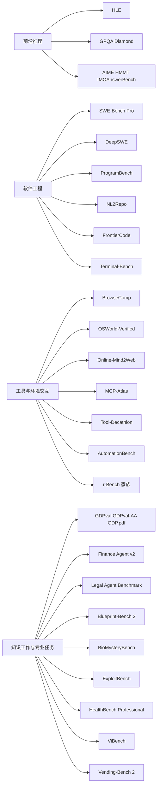

# 从排行榜到生产环境

> 过去一年的大模型评测，正在从“会不会做题”快速转向“能不能把事做完”。GLM-5.1、GLM-5.2、Claude Opus 4.8 与 Claude Fable 5 所引用的测试集，明显分成四层：前沿推理与学科题、软件工程与终端操作、浏览/电脑/工具使用、以及知识工作与专业任务。最重要的结论并不复杂：**单一分数几乎从来不够选模型**。高数学分不等于高 agent 能力，高工具分不等于高事实性，高专业分也不等于通用稳健。真正有参考价值的，是看它在你所处工作流的那一层，是否持续、稳定、可复现地表现更好。citeturn0view0turn9view0turn42view0turn12view0

> 这些页面共同展示了一种新共识：顶级模型评测，已经不再只盯着 MMLU 一类“定格考试”，而是大量采用 **SWE-Bench Pro、Terminal-Bench、MCP-Atlas、OSWorld-Verified、GDPval、GDP.pdf、Blueprint-Bench 2、BioMysteryBench、HealthBench Professional** 这类更接近真实工具链与真实工作产物的 benchmark。与此同时，很多分数仍然带着强烈的“评测脚手架”烙印：如 **with tools**、**max effort / xhigh**、私有 harness、私有数据集、或安全回退策略，这些都会让跨模型比较变得不那么“同一把尺子”。citeturn9view0turn39view0turn13search7turn37view0turn33view2turn33view0turn22view1turn23view0turn25search2turn12view0turn42view0

## 这些页面到底在测什么

GLM-5.1 的 Hugging Face 页面把评测铺得最广：既有 HLE、GPQA-Diamond、AIME 2026、HMMT、IMOAnswerBench 这样的高难推理题，也有 SWE-Bench Pro、NL2Repo、Terminal-Bench 2.0、CyberGym、BrowseComp、τ³-Bench、MCP-Atlas、Tool-Decathlon、Vending Bench 2 这类长程 agent 评测。GLM-5.2 则更聚焦“工程化 agent”八件套：SWE-Bench Pro、Terminal-Bench 2.1、NL2Repo、DeepSWE、ProgramBench、MCP-Atlas、Tool-Decathlon、HLE。Anthropic 的 Opus 4.8 页面强调的是合作式 agent 与企业工作流：Super-Agent、CursorBench、Legal Agent Benchmark、Online-Mind2Web、Finance Agent v2。Fable 5 的评测表则进一步扩展到 GDP.pdf、Blueprint-Bench 2、AutomationBench、BioMysteryBench、ExploitBench、HealthBench Professional 等新近 benchmark。citeturn0view0turn9view0turn42view0turn12view0

上面这张“能力地图”有一个很实用的读法：**越往右，benchmark 越像真实产品工位；越往上，越像经典 closed-form 学术题。** 这也是为什么同一模型会在不同榜单上“判若两人”：它可能是数学强者，却不是终端高手；也可能是浏览/文档高手，却对从零造仓库或多工具编排并不突出。citeturn35view1turn35view2turn30view1turn22view3turn26view2turn37view0turn13search7turn22view2turn33view2turn33view0

下表先给出一个“大图景速查版”，后文再逐类展开。

| 能力层 | 代表 benchmark | 典型任务形态 | 常见指标 | 它最适合回答的问题 |
|---|---|---|---|---|
| 前沿推理 | HLE、GPQA-Diamond、AIME/HMMT、IMOAnswerBench | 多选题、短答案、竞赛题、图文题 | accuracy / exact match | 模型是否具备高难推理与学科知识上限 |
| 软件工程 | SWE-Bench Pro、DeepSWE、ProgramBench、NL2Repo、FrontierCode | 修 issue、跨文件改仓库、从零重建程序、生成整个 repo、提交可合并 PR | resolve rate、pass rate、score | 模型是否真的能承担工程任务，而不仅是补几行代码 |
| 终端环境 | Terminal-Bench | shell、系统管理、训练、数据处理、安全 | task success / acc | 模型在 CLI/容器环境里是否能独立完成任务 |
| 浏览与电脑操作 | BrowseComp、Online-Mind2Web、OSWorld-Verified | 搜网页、操作真实网站、操作真实桌面应用 | pass rate / success rate | 它会不会“自己找信息、自己点、自己做” |
| 工具编排 | MCP-Atlas、Tool-Decathlon、AutomationBench、τ-Bench | 多工具发现、参数填充、跨应用工作流、人与 agent 协作 | pass rate、coverage、end-state correctness、pass^k | 它能不能在复杂业务系统里把工具用对、串好、做稳 |
| 知识工作与专业领域 | GDPval、GDPval-AA、GDP.pdf、LAB、HealthBench Pro、BioMysteryBench、ExploitBench、Blueprint-Bench 2、ViBench、Vending-Bench 2 | 文档/表格/PDF、法律工作产物、临床对话、生物数据分析、漏洞利用、空间重建、端到端 app 构建、长期经营 | rubrics、Elo、bank balance、connectivity score、capability ladder | 它能不能在现实行业任务里产出“拿得出手的结果” |

表中的分类来自这些 benchmark 的官方论文、官方主页、数据集说明与各模型发布页所公开的任务描述。需要特别留意的是，**同名 benchmark 也可能有不同运行协议**：例如 HLE 常被报告为“无工具 / 有工具”两种口径；Terminal-Bench 2.1 常随 harness 一起变化；Fable 5 的若干带星 benchmark 还受到安全回退策略影响，官方自己就在脚注中说明这些星标项目的 Fable 分数会更接近 Opus 4.8。citeturn13search0turn13search2turn33view2turn12view0turn42view0

## 通用推理与数学科学

### Humanity's Last Exam

HLE 由 CAIS 与 Scale AI 发起，是一个面向“人类知识前沿”的多学科闭卷式 benchmark。它在当前公开版本中包含 **2500 道**跨数学、自然科学、人文等领域的问题，题型包括多选和短答案，目标是让答案“容易核验、难以直接检索”，因此它测的不是单纯记忆，而是**高难推理 + 跨领域知识整合 + 校准能力**。citeturn35view1turn13search8

示意题型可以这样理解。其一：给出一张来自天体物理或材料科学的图表，问题要求模型判断“哪种机制最符合图中变化趋势”，期望输出不是长篇散文，而是**唯一可核验的选项或短答案**。其二：给出一段需要高背景知识的历史或文学材料，要求模型识别作者、流派或隐含概念，仍然以**短答案**为准。其三：有些题会结合图像与文字，让模型先正确读图，再完成判断。HLE 的目的不是复刻学校考试，而是制造“**验证远比求解容易**”的前沿题。citeturn35view1

HLE 的长处，在于它比大量已被刷高分的旧 benchmark 更难、更广、更难靠公开网页直接搜到答案；短板也很明显：它仍然是**closed-ended academic eval**，并不直接衡量工具使用、长期计划、协作、代码落地或文档工作流。页面里常见的 “HLE with tools” 分数，也通常是模型厂商给模型外挂工具后的运行结果，而不是原论文里的单一标准协议，所以把“无工具 HLE”和“有工具 HLE”混看，很容易误读。citeturn35view1turn0view0turn9view0turn12view0

选模型时，HLE 更像“**上限与通用智力温度计**”。如果两个模型在 HLE 上差 10 分，通常意味着推理能力代际差明显；如果只差 1–2 分，要先问清楚 effort、采样、工具、是否多次投票后再下结论。它适合筛掉“推理明显不够”的模型，但不适合单独决定谁更适合上生产。citeturn35view1turn9view0turn12view0

### GPQA-Diamond

GPQA 是著名的 graduate-level Google-proof 问答 benchmark，原始版本有 **448 道**生物、物理、化学的专家题；其中更常出现在发布页上的 **GPQA-Diamond** 是更严格、更难的 **198 题**子集，要求两位专家验证者都答对、而多数高水平非专家答错，因此它主要测的是**研究生到博士级别的科学推理与专业知识辨析**。citeturn35view2turn36search1turn36search15

它的任务非常像“硬核理科四选一”。示意题一：给一个化学谱图或结构描述，问哪种反应路径最可能发生，期望输出是单个选项。示意题二：给出生物实验现象，要求识别最可能的基因调控机制。由于题目刻意追求“Google-proof”，模型不能只靠搜索碎片事实拼凑答案，而必须把领域知识真正串起来。citeturn35view2turn36search2

GPQA-Diamond 的优点，是难度高、专业性强、验证简单；缺点，是它覆盖面窄，只测理科三门，且样本量 **198** 并不大，小幅领先未必有统计意义。Epoch 专门提醒过，小规模 benchmark 的 prompt 与温度变化就可能带来几分波动。citeturn36search2turn36search4

如果模型要用于科研助理、药物研发前期检索、技术尽调等重理科场景，GPQA-Diamond 很有参考价值；但如果场景是浏览网页、操作 IDE、读合同或写报告，它只能告诉你“这个模型是不是够聪明”，不能告诉你“它是不是够能干”。citeturn35view2turn36search1turn33view2

### AIME、HMMT 与 MathArena 竞赛数学集

AIME 2026 与 HMMT Nov 2025 / Feb 2026 本质上不是某家实验室从零设计的新 benchmark，而是**真实竞赛题**被 MathArena 这类评测平台转化为持续维护的数学评测数据集。AIME 2026 在 MathArena 数据集中有 **30 题**，每题都是唯一短整数答案；HMMT 则来自 Harvard-MIT 数学赛的历年原题。它们共同测的是**多步符号推理、构造、组合计数、代数与几何技巧**。citeturn34view3turn34view4turn40search0turn40search7

AIME 的任务形态最直接：输入是一道竞赛题，输出是 **0–999 的最终整数答案**。例如公开数据集展示的一题，要求计算满足模 3 条件的有序 7 元组个数，期望输出就是一个精确整数，而不是过程评分。HMMT 与 AIME 类似，但题型与难度分布略有不同，HMMT 官网也明确区分了 November 与 February 赛事。citeturn34view3turn34view4

这类 benchmark 的长处，是**污染少、可解释、更新快、精确判分**；短板也同样明显：样本很小、对输出格式极为敏感，而且大量厂商会使用不同的 prompt、不同的 reasoning token 上限和 self-consistency 方案。竞赛数学高分，常常首先说明“模型愿意花 token 思考”，而不一定说明它在业务里更省钱或更稳定。citeturn40search0turn40search7turn17search15

实际选型时，AIME/HMMT 更适合作为**reasoning 模型的副指标**：当你在比较“同一厂家的不同思考模式”或“是否值得启用高 effort”时，它很有用；当你在比较“哪个模型更适合读财报、写前端、操控浏览器”时，它的参考价值就会显著下降。citeturn40search0turn9view0turn42view0

### IMOAnswerBench

IMOAnswerBench 来自 Google DeepMind 的 IMO Bench 套件，官方仓库将其定义为 **400 道**高难短答案数学题，用来评估“稳健数学推理”，尤其是贴近 IMO 风格、但可自动判分的题。它测的不是一般 school math，而是**长链条构造、分类讨论、抽象代数/组合/数论式推理**。citeturn34view2turn18search0turn18search10

示意题一：给出一个需要构造参数与极值论证的组合题，期望输出唯一数值。示意题二：给出数论条件，要求输出可验证的整数或集合大小。和 AIME 一样，它最终也往往是短答案，但它比 AIME 更接近 Olympiad 风格，因此对“先想框架再收束”为数值结论的能力要求更高。citeturn18search0turn18search10

它的优势，是把 IMO 级别的数学能力收敛成可自动评分的问题；局限则是它依然偏向“最终答案”，不能完全反映证明质量，而证明质量需要 IMO-ProofBench 一类更难评的协议。对于需要极强数学研究感的选型，它很有辨别力；对于通用 chat 应用，它和 GPQA 一样，更多是“天花板能力”的旁证。citeturn18search0turn34view2

## 软件工程与终端操作

### SWE-Bench Pro

SWE-Bench Pro 是 Scale 推出的新一代软件工程 benchmark，论文与官方 leaderboard 都把它定位成比 SWE-Bench Verified 更接近真实企业软件开发的测试。它共有 **1865 个问题、41 个仓库**，并区分 public / private / held-out 子集；任务往往需要跨多文件改动，修 bug 或实现功能，并通过 fail-to-pass 与 pass-to-pass 测试双重验证。它测的是**真实仓库理解、问题定位、跨文件修改、回归控制**。citeturn30view0turn30view1

示意任务可以理解成两类。第一类：给出 issue、需求简报和上下文，让模型修复某个生产 bug；期望输出是一份 patch，既让新增失败测试转为通过，又不破坏旧功能。第二类：给出功能请求和接口约束，让模型实现一个 feature，同样要过完整测试。它的核心不是“写出看起来像样的代码”，而是“**真正使仓库进入正确状态**”。citeturn30view1

SWE-Bench Pro 的强项，是场景真、污染控制较强、难度远高于旧版；不足是它仍然大量依赖测试作为真值，测试覆盖不到的代码质量与维护性未必被充分衡量。此外，不同厂商常用不同 scaffold、不同 token 预算与不同工具箱，因此榜单既是“模型能力”比较，也是在比较“模型 + agent 系统”的整体工程。citeturn30view1turn30view0

对于模型选型，这个 benchmark 很有现实意义。只要你的业务里有中到长程代码修改、需要理解旧仓库、并且回归错误代价高，SWE-Bench Pro 应该是**比纯代码补全分数更值得看的指标**。但如果业务主要是“生成一个新脚本”或“解释错误信息”，ProgramBench、Terminal-Bench、FrontierCode 反而可能给出更好的补充视角。citeturn30view1turn28search0turn39view0turn25search0

### DeepSWE

DeepSWE 是 2026 年很受关注的新 benchmark，目标是把“前沿模型在 coding 任务上已经开始聚堆”的问题重新拉开。官方站点强调它是 **contamination free** 的长程软件工程 benchmark，当前公开信息显示它有 **113 个任务、91 个仓库、5 种语言**，使用隔离环境和手写行为验证器，并统一在同一 scaffold 上跑模型。它要测的是**真正长程、低污染、重行为验证的软件工程能力**。citeturn22view3turn19search12

DeepSWE 官方页面给出的任务例子，很能说明它的口味：比如在 happy-dom 中确保 shutdown 时中断 body reads 能正确 abort；在 Prometheus 中修复 mixed typed/untyped label 排序；给 Cliffy 命令增加配置文件解析；在 yjs 里实现确定性的冲突检测。期望输出都是**能通过行为级 verifier 的仓库修改**。citeturn22view3

DeepSWE 的最大价值，是把“是否见过答案”与“是否真会做”尽量拆开；弱点是它非常新，社区对其构造与运行仍在持续讨论，且样本规模还不像老牌 benchmark 那样经过多年交叉验证。因此 DeepSWE 适合用来做**前线 coding agent 的增量比较**，但还不该单独成为采购决策的唯一依据。citeturn22view3turn19search12

### ProgramBench

ProgramBench 的命题非常狠：**不给源代码，只给可执行程序和文档**，要求模型从头架构并实现一个完整代码库，重建程序行为。论文当前公开的是 **200 个任务**，覆盖从小型 CLI 到 FFmpeg、SQLite、PHP 解释器这类大程序；评估依赖 agent-driven fuzzing 生成的端到端行为测试。它测的是**产品级程序理解、逆向式行为归纳、架构设计与全仓库实现**。citeturn28search0turn28search1

示意任务一：给你一个压缩工具二进制和 man page，让你重写一个行为一致的新版本。示意任务二：给你一个小型数据库程序的文档和可执行文件，让你推断命令语义、数据格式、边界条件，并产出完整仓库。期望输出不是“答对算法题”，而是**一个可运行的新程序**。citeturn28search0turn28search1

ProgramBench 的长处，是它几乎把 today’s coding hype 中最难的一环——“从零做系统”——单独挑出来测；局限也很明显：它对绝大多数模型都极难，当前更像“天花板探针”而不是“稳定排序器”。如果模型在这里接近 0，不代表它不能辅助工程师；反过来，如果它在这里领先，也不意味着它在修成熟仓库 issue 时一定同样领先。citeturn28search0

### NL2Repo

NL2Repo-Bench 的目标和 ProgramBench 有点像，但切口不同：它要求模型从**单份自然语言说明文档**出发，生成完整、可安装、可测试的 Python 仓库。论文与仓库给出的公开规模是 **104 个任务**，覆盖 web、数据分析、系统工具、ML 等多个类别，并按 LOC 分出 easy/medium/hard。它测的是**从需求文档到完整 repo 的耐力、规划与跨文件一致性**。citeturn29view0turn29view1

示意任务一：输入是一份“请实现一个带命令行接口的数据处理库”的长文档；期望输出是完整 Python 包，带目录结构、依赖、模块、测试全部通过。示意任务二：输入是一个 web/service 需求说明；期望输出是 installable repo，而不是单文件 demo。citeturn29view0turn29view1

NL2Repo 的优点，是它比修 issue 更像“0 到 1 建项目”；缺点，是目前公开生态还不如 SWE-Bench 成熟，而且任务集中在 Python repo，也会限制跨语言泛化的代表性。若团队主要在做“需求到 repo”的 agent 工具，NL2Repo 比 SWE-Bench Pro 更贴脸；若主要在维护遗留仓库，还是 SWE-Bench Pro 更合适。citeturn29view0turn29view1

### FrontierCode

FrontierCode 来自 Cognition，它把“代码是否正确”往前推进到“**这份代码你真的会 merge 吗**”。官方介绍说明它有 **150 个任务**，分 Extended / Main / Diamond 三层，其中 Diamond 是最难的 **50 题**。它报告 **pass rate** 与 **score** 两种指标，并用 maintainer 视角的 blocker rubric 来评判代码是否达到生产级 merge 标准。它测的不是单纯解题，而是**代码质量、边界处理、风格与可维护性**。citeturn25search0turn25search6

示意任务一：在真实开源仓库里实现一项功能，除了通过测试，还必须保证 scope 合理、命名一致、没有“review blocker”。示意任务二：修正一个复杂 bug，期望输出不仅跑通，而且补齐/维持应有测试、避免 hacky patch。它的真正目标，是把“能跑”与“能进主干”分开。citeturn25search0turn25search6

FrontierCode 的优势，是终于开始测“代码品味”；局限，是 rubric 带来一定主观性，且 benchmark 新、规模相对有限。实际解读时，如果两个模型在 SWE-Bench Pro 接近，而在 FrontierCode 拉开差距，通常意味着它们都能做对事，但只有一个更像成熟工程师。citeturn25search0turn25search6

### Terminal-Bench

Terminal-Bench 是面向终端 agent 的公开 benchmark 体系。官网显示，Terminal-Bench 2.0 有 **89 个任务**，覆盖软件工程、机器学习、安全、数据科学等，采用 harbor-native 终端环境；2.1 则是后续改进版本，但当前官方仍写明“任务尚未上传”，因此详细数据还未完全公开。它测的是**在 shell / 容器中独立执行、调试、训练、配置、排障的能力**。citeturn39view0turn39view1

Terminal-Bench 官方公开示例非常具体：比如从源码编译 Linux kernel 并注入 printk；把 git server 与 webserver 配好使 push 自动部署；从 7z hash 中恢复口令并写入 /app/solution.txt；用 openssl 生成符合要求的证书与校验脚本；或写两个脚本对数据集重分片与还原。期望输出是**终端环境里的正确文件与系统状态**。citeturn39view0

它的优点，是跟真实 CLI 工作极像，远比“写个函数”更能区分 agent；限制在于结果强依赖 harness、超时、可用工具和环境配置。Anthropic 也在 Opus 4.8 页面专门脚注说明，Terminal-Bench 2.1 的分数依赖 public harness，而 GPT-5.5 若换 Codex CLI harness 口径还会不同。换句话说，终端 benchmark 最怕“**模型比较，结果其实在比 agent 外挂**”。citeturn39view0turn42view0

## 浏览、电脑操作与工具使用

### BrowseComp

BrowseComp 是 OpenAI 推出的浏览 agent benchmark，目标很明确：测模型能否在网上找到“**难找但易验证**”的信息。它有 **1266 道**问题，答案短、唯一、可核验，强调 persistence 与 creative search，而不是开放式长文回答。它测的是**网页搜索策略、信息定位、事实判别与耐心**。citeturn26view2turn14search20

官方公开的例题非常经典：识别一个“会打破第四面墙、背景与无私苦行者有关、幽默感很强、在 1960–1980 年间播出不足 50 集电视节目的虚构角色”，标准答案是 **Plastic Man**。这类题最能体现 BrowseComp 的设计哲学：答案本身很容易验证，但定位路径并不直给。再比如，许多题需要横跳多个站点、拼接作者背景、作品信息、时间线，最后输出一个短答案。citeturn26view2

它的优点，是极易自动判分，也确实能测出浏览 agent 的 persistence；局限则是它有意避免开放式真实用户查询，因此“在 BrowseComp 上强”不必然等于“给用户写综合研究报告也强”。此外，Anthropic 还专门发文讨论过 BrowseComp 的 contamination 问题：公开 benchmark 的答案会沿博客、issue、论文在网上扩散，浏览型 agent 反而可能在运行时搜到 benchmark 泄露。citeturn26view2turn14search11

### OSWorld-Verified

OSWorld 是一个真实计算机环境 benchmark，官方介绍其基准包含 **369 个真实电脑任务**，支持任务设置、执行式评估与跨操作系统环境；2025 年升级后形成 **OSWorld-Verified** 版本，用于统一协议下的官方结果。它测的是**“电脑使用”意义上的多模态 agent 能力**：看屏幕、理解 UI、跨应用操作、收敛到正确状态。citeturn37view0

示意任务包括：在桌面环境中打开若干应用，编辑文档、下载/整理文件、发送邮件、操作表格，或者完成跨窗口的信息搬运。期望输出不是自然语言，而是**计算机环境最终状态正确**。这与浏览 benchmark 最大不同在于，它不只测“查到信息”，还测“把信息真正用在 GUI 里”。citeturn37view0

OSWorld 的优势，是贴近真实 computer-use 产品；弱点是环境复杂、复现实验成本高，而且少量任务会受到网络依赖影响。官方还特别说明 Google Drive 相关任务可能需要额外配置，因此同一模型的结果也可能随着协议更新而变化。选型时，如果你的产品是“电脑代办型 agent”，OSWorld-Verified 应该比单纯网页 benchmark 更重要。citeturn37view0turn42view0

### Online-Mind2Web

Online-Mind2Web 是对 Web agent 很关键的线上评测，当前公开信息为 **300 个任务、136 个网站**，覆盖购物、住房、餐饮、交通等真实网站，并持续替换失效任务。它测的是**在活网站上完成真实网页任务**，而不是在静态快照里点按钮。citeturn31search0turn37view1

示意任务可以想成：“在真实电商网站上筛选满足条件的商品并加入购物车”“在房产网站上找到满足预算和位置条件的房源”“在航空或政府网站上完成指定搜索并记录结果”。期望输出是**任务完成**，而非只是给出一个可能答案。官方还为此推出了自动评审方法，报告其与人工判断约有 **85%–86% 一致性**。citeturn31search0turn37view1

它的优点，是极接近浏览器 agent 的真实工作；限制同样明显：网站会变、CAPTCHA 会出现、任务会过期，因此 benchmark 本身需要持续维护。看到厂商报 Online-Mind2Web 高分时，要顺手问三个问题：跑的是哪版任务、是否是最新替换集、自动 judge 还是人工复核。citeturn37view1turn42view0

### MCP-Atlas

MCP-Atlas 是当前最具代表性的多工具 benchmark 之一。官方论文与 GitHub 说明它由 **36 个真实 MCP servers、220/307 个工具、1000 个任务**构成，并公开了 **500 题**子集。任务故意不用提示词直接点名工具，让模型自己发现、选择并编排 3–6 次工具调用，还会记录发现、参数化、语法、错误恢复、效率等诊断。它测的是**真实 MCP 工具使用能力，而不是“函数调用 demo”**。citeturn13search7turn26view1

示意任务一：给出“帮我汇总最近三个月关于某客户的销售、支持工单与日历会议，并生成待办事项”，模型需要自己发现 CRM、邮箱、工单、日历相关 servers，并把调用顺序排好。示意任务二：给出“在数据库查指标、跑脚本、再把结果写进生产力工具”，期望输出不只是一段答案，而是**最终 claims 被 rubric 满足**。citeturn13search7turn26view1

MCP-Atlas 的长处，在于真实 server、多步工具链、部分可复现；弱点是评分含有 claims-based judging，与真实部署中的权限、网络、速率限制相比仍是简化版。对于已经决定走 MCP 架构的团队，它比“模型支持 function calling”这种 marketing 文案有价值得多。citeturn13search7turn26view1

### Tool-Decathlon 与 AutomationBench

Tool-Decathlon 也叫 Toolathlon，是一个长程、多工具 benchmark。公开材料显示它覆盖 **32 个应用、604 个工具、108 个任务**，强调真实环境、长轨迹与执行式评估。演示例子就很贴近办公自动化：自动检查邮箱里的作业，然后去 Canvas 评分。它主要测**异构工具泛化、长程状态管理与执行稳定性**。citeturn14search5turn26view0

AutomationBench 来自 Zapier，切得更偏业务流程自动化。GitHub 与论文说明它使用 **47 个模拟 SaaS 工具**、跨销售、营销、运营、支持、财务、HR 六大业务域，每个任务看模型是否把系统留在正确 end-state。它测的是**跨应用编排 + 业务规则遵循 + 正确落库/落状态**。citeturn22view2turn19search6

这两个 benchmark 都不再满足于“你会不会调一个 API”，而是直接问“你能不能把整个工作流做对”。Toolathlon 更强调多样性与长程工具执行；AutomationBench 更强调业务自动化与状态正确。对企业选型来说，如果目标是“自动做事”，这两者往往比传统 reasoning benchmark 更能说明问题。citeturn26view0turn22view2

### τ-Bench 家族

Sierra 的 τ-Bench 系列很有代表性，因为它把 agent 放进了**动态、多轮、人与工具共同参与**的场景。原始 τ-Bench 测真实多轮任务中的可靠性；τ²-Bench 进一步引入 dual-control，需要用户和 agent 共同完成任务；τ³-Bench 又扩展到知识库与语音场景。它们测的是**任务连续性、策略稳定性、与用户协作完成真实任务的能力**。citeturn27search1turn27search5turn27search2turn27search8

一个很形象的例子来自 Sierra 自己的说明：如果用户想改机票，agent 需要多轮收集必要信息、理解规则、调用复杂航空 API 并完成改签。到 τ²-Bench，这种任务变成了“远程协作”：某些动作必须由用户亲手做，agent 只能指导。到 τ³ 的 knowledge/voice 版本，又要求一边搜索知识库，一边完成工具调用或实时语音交互。citeturn27search1turn27search5turn27search8

τ-Bench 家族最大的价值，是提醒人们：很多真实 agent 任务不是“AI 一个人做完”，而是“AI 带着人、带着规则、带着工具一起做完”。如果你的产品是客服、运维协助、销售协同，这个维度常常比单轮 benchmark 更重要。citeturn27search1turn27search5turn27search8

## 长程经营、知识工作与专业任务

### Vending-Bench 2

Vending-Bench 2 是 Andon Labs 推出的长程规划 benchmark。官方页面的定义非常简单直接：让模型经营一个自动售货机业务一整年，最后按**银行余额**打分。它测的是**长时间自洽、资源分配、库存与价格决策、长期目标保持**。citeturn38search0turn38search1

示意任务包括：从 500 美元起步，按天支付场地费、采购库存、处理供应商和顾客问题、调整售价，目标是在 365 天后让账面余额最大化。这里的“正确输出”不是某道题的答案，而是**一年后的经营结果**。这就把很多短 benchmark 不会暴露的问题全暴露出来了：循环、遗忘、幻觉式决策、长期目标漂移。citeturn38search0turn38search3

这类 benchmark 的强项，是它非常接近“长期自治 agent”真正会遇到的问题；弱点是它毕竟是模拟环境，某些经济与行为学设定可能影响结果。实际看分数时，可以把它理解成“**这模型是否容易在长任务里掉线**”的压力测试，而不是一个通用质量分。citeturn38search0turn38search3

### GDPval、GDPval-AA 与 GDP.pdf

这三者经常被放在一起谈，但它们其实测的是三件不同的事。**GDPval** 是 OpenAI 推出的现实知识工作评测，覆盖 **44 个职业、9 个行业、1320 个任务**，公开 gold set 为 **220 题**，任务来自真实工作产物，专家盲审模型产出与人类产出，并辅以 rubrics 和自动 grader。它测的是**现实知识工作 deliverable 质量**。citeturn33view2turn24search8

示意任务非常“上班”：OpenAI 页面就公开了一个制造工程师案例——要求依据附件 PDF 设计电缆卷筒工装，并提交一份 PDF 形式的概念设计汇报。你会发现，这不是“回答问题”，而是“交稿”。这正是 GDPval 的重点：模型要输出**文档、幻灯片、图示、表格**等工作产物，而不是单句答案。citeturn41view1turn41view3

**GDPval-AA** 则不是新的原始数据集，而是 Artificial Analysis 基于 OpenAI GDPval 数据集做的 agentic 评测框架与评分口径。公开方法说明表明，它使用自家的 Stirrup harness 和 Elo 风格比较，因此数字含义与 OpenAI 论文里的“胜/平人类 deliverable”并不完全等价。读到 GDPval-AA 分数时，最该先问的是：**这是原始 GDPval 结果，还是第三方 agent 口径下的 GDPval-AA？** citeturn24search3turn20search17

**GDP.pdf** 则是 Surge AI 针对“现实世界 PDF 文档”打造的多模态 benchmark。官方博客与数据集说明显示，它由 **100 个真实 prompt + PDF** 组成，覆盖金融、医疗、法律、工程、制造、地产、HR 等十个领域，按 rubric 标准逐条评分。它测的是**读复杂 PDF、抽取关键信息、跨页综合、避免看似合理但实际错误的细节幻觉**。citeturn33view0turn33view1turn31search2

GDP.pdf 的示意任务尤其容易理解：从多页剂量表里找出精确数字；在复杂附录与嵌套 exhibits 里定位 indemnification clause；在财报或技术手册中交叉核对关键信息。选型时，如果你的产品大量处理财报、合同、蓝图、医学说明书，GDP.pdf 往往比 HLE 更有意义；如果你的产品输出是长篇工作成果，GDPval 更重要；如果你看的是 Artificial Analysis 的榜单，则必须把 GDPval-AA 当作“第三方运行协议下的 GDPval 变体”来读。citeturn33view0turn33view2turn24search3

### Finance Agent v2 与 Legal Agent Benchmark

Finance Agent v2 来自 Vals AI，官方仓库与平台说明表明它是一个偏**金融分析 agent** 的 benchmark，支持 web search、EDGAR 检索、网页解析、价格历史等工具。仓库里最直观的示例问题就是：“What was Apple's revenue in 2023?”、“What was NFLX's revenue in 2024?”，说明它关注的不是金融常识，而是**数据检索、财务口径理解、工具联动与分析交付**。不过它的完整测试集与平台是门控的，因此公开方法学比开源 academic benchmark 少得多。citeturn33view3turn16search7

Legal Agent Benchmark 由 Harvey 推出，当前版本公开为 **1200+ 任务、24 个法律实践领域、75000+ rubric criteria**。每个任务都有一条律师式 instruction、一份 client matter 和一个需要交付的 work product，目标是复制大律所里真实的“收任务—查材料—交底稿”流程。它测的是**法律产物生成、法务长程任务完成与严格 all-pass 评分下的可靠性**。citeturn33view4turn31search3

这两个 benchmark 的共同特点，是把“专业工作”从问答推进到工作成果。它们的优势，在于业务贴脸；局限在于平台与数据的开放程度不如纯 academic benchmark。对于金融/法律产品团队，这类 benchmark 的权重应该高于 HLE；对于通用聊天模型，它们则更像专业适配度指标。citeturn33view3turn33view4

### Blueprint-Bench 2、BioMysteryBench、ExploitBench、HealthBench Professional、ViBench

这几个 benchmark 是 Fable 5 发布里最值得单独看的一批“新型能力测试”。

**Blueprint-Bench 2** 来自 Andon Labs，要求模型查看每套公寓约 **20 张室内照片**，生成对应的 **2D 户型图**，共处理 **50 套公寓**，并按连接图相似度、房间数、门数、朝向等子指标综合评分。它测的是**从多视角照片中恢复空间结构**，本质上是“空间智能”而不是 OCR。其示意任务非常清楚：输入是一组房间照片，输出则是房间节点与门连接关系的结构化平面图。citeturn22view1

**BioMysteryBench** 由 Anthropic 发布，用真实生物信息学数据构造 **99 道**问题，其中 **76 道**被定义为至少一位专家可解的人类可解题。官方给出的真实示例包括：识别单细胞 RNA-seq 数据来自哪个器官、根据 RNA-seq 推断被敲除的基因、根据全基因组测序判断亲子关系、区分 ChIP 样本与 input control、根据 H3K27ac peaks 识别细胞类型。它测的是**计算分析与生物学推理交织的科研能力**。citeturn23view0turn23view2turn23view5

**ExploitBench** 是一个非常重要但也很敏感的安全 benchmark。它不是把“是否 exploit 成功”当成二元结果，而是把利用过程拆成 **16 个 capability flags**，从 reach code、crash，到 sandbox primitive、arbitrary read/write、control-flow hijack、ACE，逐层打点。它测的是**漏洞利用能力梯度**，而不是简单 crash 成功率。对于希望评估模型安全风险或安全研究协助能力的团队，它比传统 cyber benchmark 更细。citeturn25search1turn25search13

**HealthBench Professional** 来自 OpenAI，包含 **525 个**由医生撰写的真实临床对话任务，覆盖 care consult、writing/documentation、medical research 三类场景，并由多位医生多轮制定 rubric。它测的不是“会不会做医学选择题”，而是**在临床对话上下文里给出可接受、可审阅的专业回复**。如果你的产品面向临床协作，这个 benchmark 比一般医考题靠谱得多。citeturn25search2turn25search5

**ViBench** 则把“vibe coding”正式 benchmark 化。公开介绍表明，它来自 **15 个应用场景的生产轨迹**，评估的是“自然语言到可运行 web app”的端到端生成，从用户视角打分，而不是只看代码片段是否正确。它测的是**从需求到产品原型的完整 app 构建能力**。citeturn20search3turn32search6

这组 benchmark 的共同优点，是都比“抽象题”更贴生产；共同缺点，是都很新，许多还在快速演化，榜单稳定性与社区共识仍在形成中。真要拿来做选型，最稳妥的办法不是盯某一个，而是看它是否与你的产品形态真正同构：做生物数据分析就看 BioMysteryBench，做临床协作就看 HealthBench Professional，做空间重建就看 Blueprint-Bench 2，做网页原型生成就看 ViBench。citeturn22view1turn23view0turn25search1turn25search2turn20search3

## 页面中提到但公开信息仍不足的评测

还有几类名字频繁出现在厂商页面里，但公开方法学明显不够完整：**CursorBench、Super-Agent benchmark、Hebbia Finance Benchmark、IMC trading-analysis evals、everyday spreadsheet suite**。其中 CursorBench 至少能从 Cursor 的公开技术材料里确认它是一套现实软件工程 benchmark；Super-Agent benchmark 则在 Anthropic Opus 4.8 页面里以客户 quote 的形式出现，但公开任务集、规模、评分协议都不充分。Hebbia、IMC 与 spreadsheet suite 主要以客户/合作方评价形式出现，更多说明“某些真实工作流里体感更好”，而不是一个人人可复跑的标准 benchmark。citeturn42view0turn32search4

这类指标不是没有价值，而是**不适合当作首要采购依据**。它们最适合当“辅助信号”：如果公开 benchmark 与你的私有试跑结果都已经支持某模型，而客户私有 eval 又进一步正向，那可以增强信心；反过来，如果一个模型只在私有 quote 里好看、在公开 benchmark 上没有同样表现，那就要格外谨慎。citeturn42view0

## 怎么把这些分数变成选型判断

先说一个最容易踩的坑：**不要把不同层级 benchmark 的分数直接平均成“总实力”**。HLE、GPQA、AIME 主要告诉你“这个模型会不会想”；SWE-Bench Pro、Terminal-Bench、ProgramBench、NL2Repo、FrontierCode 告诉你“这个模型会不会干工程活”；BrowseComp、Online-Mind2Web、OSWorld-Verified、MCP-Atlas、AutomationBench、τ-Bench 告诉你“给它环境和工具后，它会不会把流程真正走完”；GDPval、GDP.pdf、LAB、HealthBench Professional 等告诉你“交到你桌上的工作产物像不像真的能用”。这四层彼此有关，但不能互相替代。citeturn35view1turn30view1turn39view0turn26view2turn37view0turn13search7turn22view2turn33view2turn33view0turn33view4turn25search5

再说第二个坑：**分数必须带着运行协议一起看**。GLM-5.2 的图明确写着“所有模型都在 maximum thinking effort 下评测”；Opus 4.8 页面专门给 Terminal-Bench 2.1 与 OSWorld-Verified 写了脚注；Fable 5 的表格又说明星标 benchmark 会因为安全回退而让 Fable 接近 Opus 4.8。看到一个分数之前，至少要问：有没有工具、用什么 harness、 effort 多高、是否多次采样、是否有安全回退、是否私有 subset。citeturn9view0turn42view0turn12view0

如果要给一个**面向生产的最小通用评测篮子**，我会选下面这一套：

| 目标 | 最小必看 benchmark | 为什么 |
|---|---|---|
| 通用推理下限 | HLE **或** GPQA-Diamond | 先判断模型有没有足够“脑力”，避免拿明显推理不足的模型去做复杂工作流 |
| 软件工程 | SWE-Bench Pro | 看它能否理解成熟仓库并安全改动 |
| 终端/异步 agent | Terminal-Bench 2.1 | 看它在 CLI 环境是否真能完成长任务 |
| 工具编排 | MCP-Atlas | 看它会不会发现、选择、串联真实工具 |
| 电脑/网页操作 | OSWorld-Verified **或** Online-Mind2Web | 看它能不能真的“自己点、自己做” |
| 知识工作 | GDPval **或** GDP.pdf | 看它能不能交付现实 work product，而不仅是答题 |
| 行业专项 | LAB / HealthBench Pro / BioMysteryBench / ExploitBench / ViBench 等取其一 | 把通用强项映射到你的垂直场景 |

这套“最小篮子”的逻辑是：**一个通用生产模型，至少要过脑力、工程、工具、环境、工作产物、行业任务六道门。** 如果只看前两道，容易买到“很聪明但不落地”的模型；如果只看后三道，容易买到“会走流程但想不深”的模型。citeturn35view1turn36search1turn30view1turn39view0turn13search7turn37view0turn37view1turn33view2turn33view0turn33view4turn25search5turn23view0turn25search1turn20search3

就重叠与空白而言，这些 benchmark 的重叠主要集中在三处。第一，SWE-Bench Pro、DeepSWE、NL2Repo、ProgramBench、FrontierCode、Terminal-Bench 都在测“编码 agent”，但切的层次不同：修 issue、全 repo 生成、终端执行、生产级 merge 质量，各自回答了不同问题。第二，BrowseComp、Online-Mind2Web、OSWorld-Verified、MCP-Atlas、Toolathlon、AutomationBench、τ-Bench 都在测“agent 与环境交互”，但有的偏搜索，有的偏 GUI，有的偏 API，有的偏人与 agent 协作。第三，GDPval、GDP.pdf、Finance Agent v2、LAB、HealthBench Professional、BioMysteryBench 则都在问“工作产物是否靠谱”，只是行业不同。citeturn30view1turn22view3turn29view1turn28search0turn25search0turn39view0turn26view2turn37view0turn37view1turn13search7turn26view0turn22view2turn27search1turn33view2turn33view0turn33view3turn33view4turn25search5turn23view0

真正的空白也很值得警惕：这些发布页里提到的 benchmark，整体上**并不系统覆盖多语言性、偏见、公平性、长期事实一致性、输出稳定性、成本/延迟、隐私、越狱鲁棒性**。Anthropic 的系统卡当然会做安全与对齐测试，但那和公开 benchmark 不是一回事；而 GLM 与 Anthropic 页面里大量使用的高 effort / max effort 结果，也没有把“同等质量下谁更便宜、谁更快、谁更稳定”自然地呈现出来。生产选型最终仍然要靠**私有 eval** 补上这一块。citeturn42view0turn12view0turn9view0

### 开放问题与局限

这份报告优先采用了论文、官方 benchmark 主页、数据集页面和模型发布页中的一手资料，但仍有几类信息不完全公开。其一，CursorBench、Super-Agent benchmark、Hebbia Finance Benchmark、IMC trading-analysis evals、spreadsheet suite 这类评测，公开数据规模、prompt 模板、评分协议、统计误差通常不足，因此只能作谨慎解读。其二，Terminal-Bench 2.1、Fable 5 的部分星标安全相关 benchmark、以及不少“with tools”结果，都强依赖 harness 与运行策略。其三，新 benchmark 如 DeepSWE、Blueprint-Bench 2、ViBench、ExploitBench 仍在快速迭代，今天的榜单不一定等于半年后的稳定共识。citeturn42view0turn39view1turn12view0turn22view3turn22view1turn20search3turn25search1

真正成熟的模型评估，从来不是“挑一个最高分榜单就结束”。更接近现实的做法，是把公开 benchmark 当作**能力地图**，再用你自己的私有任务集做最后一公里：拿你真实代码库、真实 PDF、真实表单、真实浏览流程、真实合规要求，去验证这些漂亮分数到底能否变成可交付、可复核、可持续的生产能力。citeturn30view1turn33view2turn33view0turn37view0turn13search7