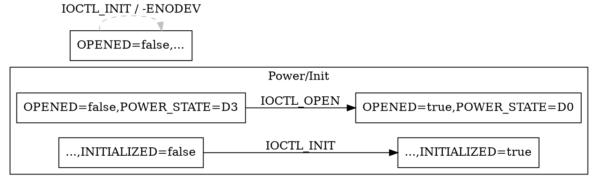

下面给你一条“从散文式分析到统一状态机”的落地路线，兼顾工程化与可维护性。核心思想是：**先把每个 ioctl 的“前置状态要求(Pre)”与“状态影响(Effect)”抽取成统一、可机读的谓词集合**，再由这些谓词自动合成“全局状态机/顺序图”（节点=系统状态，边=ioctl）。

---

# 总体流程

1. 先定义“统一状态本体（ontology）”

* 把驱动中会被提及的状态抽象为**原子谓词**（布尔或枚举/计数），例如：

  * `OPENED`, `INITIALIZED`, `POWERED`, `CONFIGURED`, `DMA_MAPPED`, `INT_ENABLED`, `LOCK_HELD(name)`, `REFCNT>0`
  * 枚举例：`POWER_STATE ∈ {D0,D1,D3hot,D3cold}`
* 列出**别名表**与**归一化规则**（如 “已上电”= `POWERED`; “完成初始化”= `INITIALIZED`）。
* 明确**初始状态**与**不变量**（如 `REFCNT≥0`、`LOCK_HELD(x)` 与 `LOCK_HELD(y)`互斥等）。

2. 针对每条 ioctl 文本进行**结构化抽取**

* 让 LLM 从“分析内容”里抽取出：

  * `pre`: 进入此 ioctl 前**必须满足**的谓词（以及可选：强/弱要求、只读/可选）。
  * `effects`: 执行成功后的**状态更改**（设置/清除/赋值/递增/递减/切换）。
  * `error_paths`: 若 `pre` 不满足会返回哪些错误；是否有**部分副作用**。
  * `resources`: 需要/释放的资源（锁、中断、内存映射句柄等）。
  * `notes`: 歧义与置信度。
* 抽取结果统一成 **JSON Schema**（下面给出模板与提示词）。

3. 归一化与一致性检查

* 将抽出的谓词通过别名表**标准化**；对不认识的词让 LLM 给出**映射建议+置信度**。
* 做**规则校验**与**冲突检测**：

  * 不可能的前置（与不变量冲突）。
  * 自相矛盾的 effect（同一字段同时 set/clear）。
  * 与其它 ioctl 的 effect 互相矛盾（例如 A 说“进入 D3”，B 的前置却要求“必须 D0 才能调用 B 且 A→B 常见”）。
* 生成**审计报告**，列出需人工确认的项（置信度低、冲突多的条目）。

4. 合成“全局状态机 / 顺序图”

* **节点**：按原子谓词的组合表达系统状态（采用**稀疏构图**：只落盘**可达**状态）。
* **边**：以 ioctl 为标签，从满足 `pre` 的状态指向应用 `effects` 后的状态。
* 避免状态爆炸：

  * 只展开你关心的子空间（如电源/初始化/配置子系统）；
  * 使用**分层状态机（Statecharts）**或**多切面视图**（power｜init｜dma 三张图）。
* 为每条边保留：来源（ioctl 名）、错误码分支、锁/资源注记、来源文本片段和置信度。

5. 可视化与导出

* 以 Graphviz DOT 或 Mermaid 生成图；按**子系统分簇**、**错误分支虚线**、**副作用标注**。
* 同时导出**机器可读**的转移系统（JSON），便于后续验证/测试生成。

6. 验证与回环修正

* 由初始状态做**可达性分析**，找不可达 ioctl 或死路/死锁环。
* 用现网/测试日志（tracepoints、ftrace、bpf）回放典型序列，验证图谱；自动标红偏差。

---

# 抽取层：JSON Schema 与提示词

**JSON Schema（示例）**

```json
{
  "name": "IOCTL_NAME",
  "pre": [
    {"expr": "OPENED == true", "level": "must"},
    {"expr": "POWER_STATE == D0", "level": "must"},
    {"expr": "DMA_MAPPED(buffer)", "level": "should"}
  ],
  "effects": {
    "set": ["INITIALIZED"],
    "clear": ["ERROR_FLAG"],
    "assign": [{"key": "POWER_STATE", "value": "D0"}],
    "inc": [{"key": "REFCNT", "by": 1}],
    "dec": [],
    "toggle": []
  },
  "resources": {
    "locks_acquire": ["dev_mutex"],
    "locks_release": [],
    "enable_irq": false,
    "disable_irq": false
  },
  "error_paths": [
    {"when": "not OPENED", "errno": "-ENODEV", "side_effects": []}
  ],
  "confidence": 0.86,
  "notes": "初始化成功后设备保持D0"
}
```

**LLM 抽取提示词（中文）**
把下面作为**系统/指令提示**用于批处理每条 ioctl 的分析文本：

> 任务：从给定 ioctl 的中文分析文本中抽取**前置条件**与**状态影响**。
> 你必须输出**严格符合**下列 JSON 模式的数据（不得添加额外字段）。
> 统一使用这些谓词与取值（列出你的状态本体清单……）。
> 如果文本出现同义词，请映射到上述标准谓词；若无法映射，放入 `notes` 并降低 `confidence`。
> 所有条件使用形如 `PRED`, `PRED(x)`, `KEY OP VALUE` 的表达；布尔统一 `true/false`，枚举使用大写字面量。
> 明确区分：**成功路径的 effects** 与 **错误路径**。若文中含“部分成功”，请在 `error_paths` 标注副作用。
> 以下是输出 JSON 模板（仅示例，不要回显注释）：
> \[贴上面的 JSON 模板]

可以先手工喂 3–5 条 ioctl 做 few-shot 示例，显著提升稳定性。

---

# 归一化与冲突处理建议

* **别名词库**（示例）

  * “已上电/电源开启”→`POWER_STATE==D0` 或 `POWERED==true`（二选一，团队先定一个主方案）
  * “已打开设备句柄/成功 open”→`OPENED==true`
  * “映射DMA缓冲”→`DMA_MAPPED(buf)`
* **自动规则**

  * 若出现 `set: ["POWERED"]` 与 `assign POWER_STATE==D3`，判为冲突→降置信度并进入审计。
  * `locks_acquire` and `locks_release` 不匹配→提示可能的**泄露/死锁**。
* 输出一份**冲突报告**：`ioctl`, 条款, 冲突点, 涉及谓词, 建议修复。

---

# 构图与可视化（工程实现要点）

**状态空间构建（伪代码）**

```python
# inputs: initial_state, ontology, parsed_ioctls[]
S = { initial_state }               # 已知可达的状态集合（哈希化的谓词集）
E = []                              # 边集合

frontier = [initial_state]
while frontier:
    s = frontier.pop()
    for I in parsed_ioctls:
        if satisfies(s, I.pre):
            s2 = apply_effects(s, I.effects)
            E.append((s, I.name, s2, I))
            if s2 not in S:
                S.add(s2)
                frontier.append(s2)

# 可选：对 S 做折叠/投影：仅保留关心的谓词子集，减少图规模
```

**Graphviz 导出（DOT 片段）**



**避免状态爆炸的三种做法**

* **按主题分图**：分别生成 Power、Init、DMA、Interrupt 四张图。
* **按投影折叠**：对每张图只保留相关谓词（例如 Power 图仅看 `POWER_STATE`, `OPENED`, `INITIALIZED`）。
* **抽象/层级**：`POWER_STATE` 细分图在一个 cluster 中展开，其它层保持折叠。

---

# 最小工作示例（两条 ioctl）

假设清单里有：

* `IOCTL_OPEN`

  * 需：无
  * 影响：`OPENED=true`, `REFCNT+=1`, `POWER_STATE=D0`
* `IOCTL_INIT`

  * 需：`OPENED==true && POWER_STATE==D0`
  * 影响：`INITIALIZED=true`

抽取后自动生成的边：

* `S0:{OPENED=false, POWER_STATE=D3, INITIALIZED=false}`

  * 经 `IOCTL_OPEN` → `S1:{OPENED=true, POWER_STATE=D0, INITIALIZED=false}`
* `S1`

  * 经 `IOCTL_INIT` → `S2:{OPENED=true, POWER_STATE=D0, INITIALIZED=true}`

就能画出一条标准“顺序图/状态机”路径：`OPEN → INIT`。若 `IOCTL_CFG` 要求 `INITIALIZED==true`，它自然只能从 `S2` 出发。

---

# 工具链建议

* **抽取与归一化**：LLM（你现在用的模型即可）+ 规则脚本。
* **建图与可视化**：Python（`networkx` 生成可达图；`graphviz`/`mermaid` 导出），或直接生 Mermaid。
* **验证**：

  * 约束检查可用 `z3`（SMT）或简单规则集合。
  * 运行时比对：BPF/ftrace 捕获 ioctl 序列，校验是否落在可达路径中。
* **持续集成**：当列表更新时，触发抽取→校验→出图→产物（SVG/PNG/JSON）发布。

---

# 交付产物形态

1. `ontology.yaml`：状态本体与别名。
2. `ioctls_parsed.json`：每条 ioctl 的结构化 pre/effects。
3. `fsm_power.dot` / `fsm_init.dot` / `fsm_full.dot`：可视化图。
4. `consistency_report.md`：冲突与低置信度清单。
5. 可选：`validator.py`：校验脚本与日志对齐工具。

---

# 实操提示

* 前期一定要**收敛谓词集合**（10–30 个足矣），否则图会失控。
* 必要时把“大状态”拆成**多维属性**（如 `INITIALIZED` 与 `CONFIGURED` 分离），这样抽取更稳定。
* 对“可能/通常/建议”这类措辞，赋予较低权重，先不入图或标注 `level:"should"`。
* 相同 ioctl 在不同平台/内核版本差异，可用 `variant` 字段拆分或在 `pre` 增加 `KERNEL>=5.10` 之类的守卫。

---

如果你愿意，我可以基于你已有的**ioctl 列表样例**立刻给出：一份抽取提示词、几条 few-shot 示例、以及自动出图的 Python 脚本骨架。
